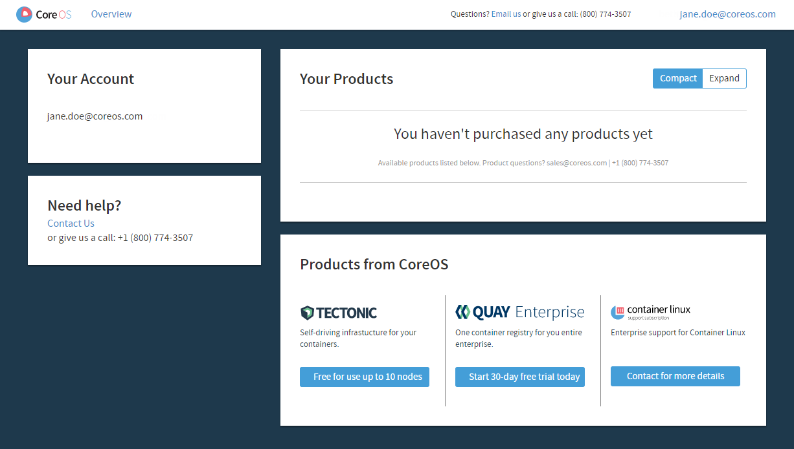
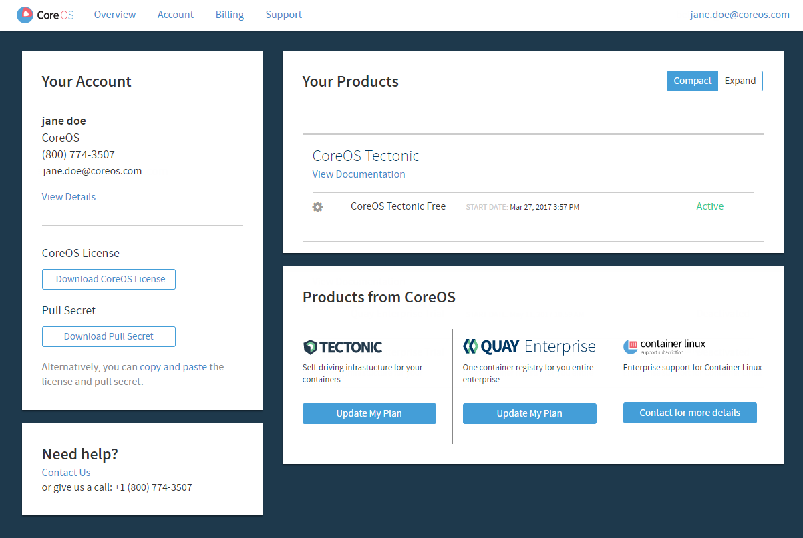

# Creating a CoreOS account

Creating a CoreOS account activates a License for up to 10 free nodes on a Tectonic cluster.

First, go to [https://account.coreos.com/login][account-login] to sign up for a CoreOS account.

A confirmation email will be sent to the listed account. Check your inbox for an email from CoreOS Support, and click *Verify Email*.

Log in to complete registration and access the account *Overview* page, which lists available CoreOS products.

  

    
  

Click *Free for use up to 10 nodes* below Tectonic, enter your contact information, and click *Get License for 10 nodes* to complete the registration process. Once complete, the *Overview* page will list active subscriptions, and provide access to your CoreOS License and Pull Secret.

  

    
  

## CoreOS License and Pull Secret

The *CoreOS License* and *Pull Secret* are required to install Tectonic and access container images for CoreOS products.

To obtain these files, [log in][account-login] to your CoreOS account, and click the buttons to *Download CoreOS License* and *Download Pull Secret*. Then, provide them when requested during the installation process.

[account-login]: https://account.coreos.com/login
