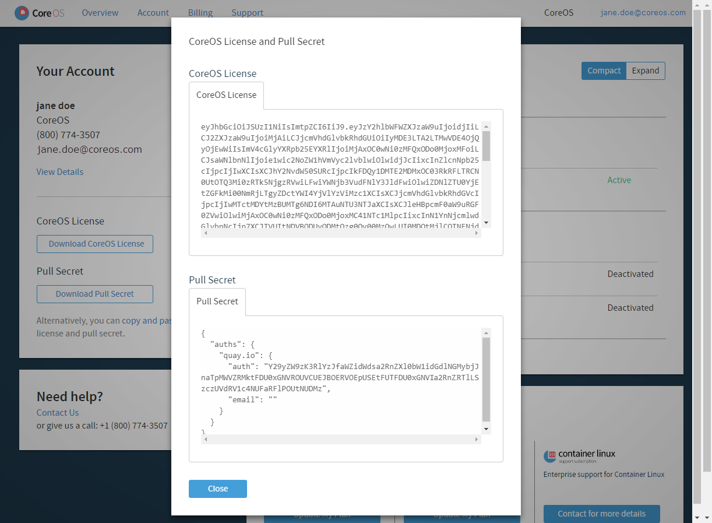

# Getting started with CoreOS Tectonic

The easiest way to learn about Tectonic is to [download and install Tectonic Sandbox][install-sandbox]. This allows you to deploy Tectonic on your local machine, and evaluate the full functionality of Tectonic and Tectonic Console.

When you’re ready to create a production ready cluster, follow these instructions to create an account, and spin up a free 10-node cluster.

## Create a CoreOS account

Go to [https://account.coreos.com/login][account-login], and click *Sign Up*.

Select an existing +Google account, or enter an email address and password, and click *Create Account*.

A confirmation email will be sent to the listed account. Click through to accept the terms of the license, activate your account, and be redirected to your *Account Overview* page.

## Obtain your License and Pull Secret

During installation, you will be asked to provide your Tectonic License and Pull Secret, which are available from your [Account Overview][account-overview] page.

When requested, log in to your [account][account-login], and click the *Overview* tab. Then, click the link to *copy and paste* the strings into the appropriate fields in Tectonic Installer.

  

    
  

## Download and install Tectonic

Go to [Getting started with Tectonic][choose-platform], select your platform, and follow the download and installation instructions provided.

[account-login]: https://account.coreos.com/login
[choose-platform]: ../install/index.md
[account-overview]: create-account.md#coreos-account-license-and-pull-secret
