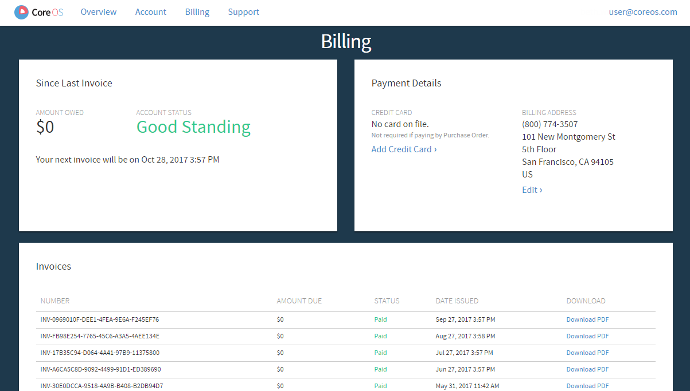

# Managing your CoreOS account

Creating an account provides up to 10 free nodes on a Tectonic cluster.

Use the account management interface to review and update your CoreOS accounts and subscriptions.

Once created, [log in to your CoreOS account][login] to:
* review and update account information (account number and contact information)
* review and update subscription plans
* obtain CoreOS License and Pull Secret
* add new users to the account
* review billing information or update payment method
* change account context

## Review account information

Click the *Account* tab to view your CoreOS account number, and review or edit your contact information.

## Review subscription plans

Use the *Overview* tab to review the history of your subscriptions, including activation date and status. It also links to CoreOS contact information to update your plans.

## Obtain CoreOS License and Pull Secret

Use the *Overview* tab to copy or download your License and Pull Secret. This information is required to install Tectonic.

## Add users to a CoreOS account

Use the *Account* tab to invite new users to an account, and manage existing user subscriptions. Users must be added to an account before they can deploy CoreOS software from the account.

To invite new users to the account, click *Invite New User*. Email invitations will be sent, from which new users may activate their account.

To accept the invitation, users must first create a CoreOS account by clicking the *Register* link at the bottom of the login box and completing email validation.

  

    
  

Once added, users will see the organization name to the left of their account name at the top of their *Overview* page. Their status on the *Account* page will change from *Invited* to *Accepted*.

To edit a user's access rights, click the sprocket to the left of their email address.

  

    
  

Select *Change Role* to assign Read Only or Admin rights to the user. Select *Revoke Access* to remove the user from the cluster.

## Review and update billing information

Use the *Billing* tab to view billing information, or to change the account's payment method or billing address.

  

    
  

## Change account context

A user may be a member of several CoreOS accounts. For example, they may have a Quay Enterprise license through work and access to a trial Tectonic cluster through a personal account. In this case, users must switch account contexts to access each license separately.

To switch contexts, click the email address in the upper right corner of the page, and select an account to load the *Overview* page for that context.

  

    
  

[login]: https://account.coreos.com/login
