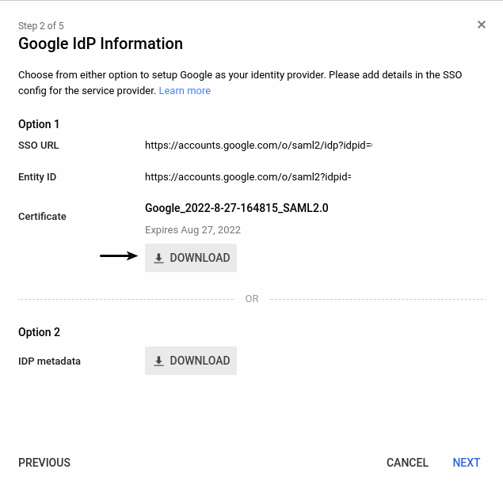
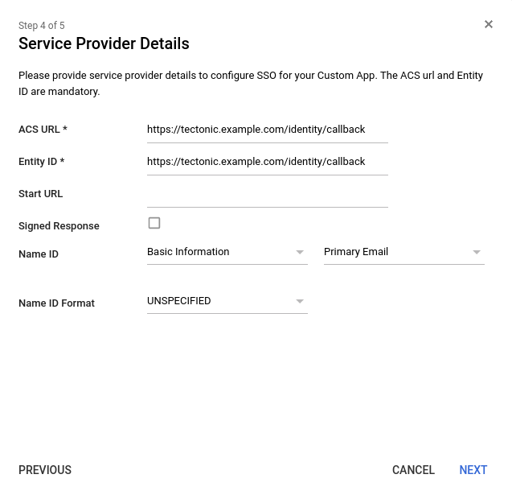

### Tectonic Identity with G Suite SAML

[G Suite][gsuite] supports setting up custom SAML applications for sign in with enterprise cloud applications. Tectonic Identity can make use of this feature.

This document assumes the document [Set up your own custom SAML application][saml-google] is being followed by a G Suite administrator and a Tectonic cluster is deployed with the DNS name: tectonic.example.com

When creating the SAML app be sure to copy the `SSO URL` and download the certificate when presented with Google IdP Information.



Two values are required during set up of the custom SAML application: ACS URL and Entity ID. These values should be set to: `https://<cluster-dns>/identity/callback`



## Identity Configuration

Below is a SAML configuration template for Tectonic Identity:

```
- type: saml
  id: saml
  name: G Suite SAML
  config:
    ssoURL:
    entityIssuer:
    ssoIssuer:
    redirectURI:
    caData:
    usernameAttr:
    emailAttr:
    groupsAttr:
    nameIDPolicyFormat:
```

`ssoURL:` SSO URL from Google IdP Information

`ssoIssuer`: SSO URL from Google IdP Information

`redirectURI:` https://<cluster-dns>/identity/callback

`entityIssuer:` https://<cluster-dns>/identity/callback

`caData:` base64 encoded certificate from Google IdP information

Run `base64 -w 0 GoogleIDPCertificate-example.com.pem` on the certificate downloaded from Google IdP Information.

The following parameters rely on the Attribute Mapping of the SAML app.

```
usernameAttr:
emailAttr:
groupsAttr:
```

An example would be:


Final configuration for G Suite SAML:

```
- type: saml
  id: saml
  name: G Suite SAML
  config:
    ssoURL: https://accounts.google.com/o/saml2/idp?idpid=1234567
    entityIssuer: https://tectonic.example.com/identity/callback
    ssoIssuer: https://accounts.google.com/o/saml2?idpid=1234567
    redirectURI: https://tectonic.example.com/identity/callback
    caData: 'LS0tLS1CRUdJTiBDRVJUSUZJQ0F[truncated]'
    usernameAttr: name
    emailAttr: email
    groupsAttr: groups
    nameIDPolicyFormat: persistent
```

## Deploy to cluster

Deploy this to Tectonic Identity by following the [Editing Tectonic Identity Configuration][edit-identity] documentation.

## Turn on SSO to your new SAML app

Instructions from the [G Suite Custom SAML Application][saml-google]:

```
In your Google Admin console (at admin.google.com)...
From the Admin console dashboard, go to Apps and then SAML Apps.
Requires having Super Admin privileges, or ask another super administrator at example.com to do these steps for you.

Select your new SAML app.
At the top of the gray box, click More Settings and choose:
On for everyone to turn on the service for all users (click again to confirm).
```


[gsuite]: https://gsuite.google.com/
[saml-google]: https://support.google.com/a/answer/6087519
[edit-identity]: https://coreos.com/tectonic/docs/latest/admin/saml-user-management.html#editing-tectonic-identity-configuration
