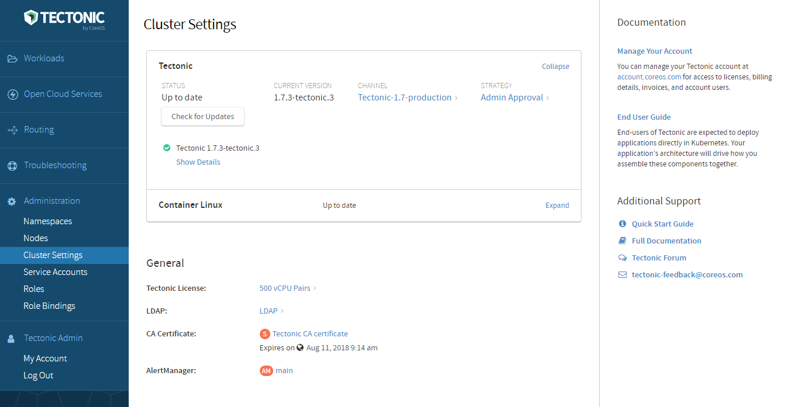

# Upgrading Tectonic &amp; Kubernetes

Use Tectonic Console to control the process by which Tectonic and Kubernetes are updated. Clusters are attached to an update channel and are set to update either automatically, or with admin approval.

  

    
    
Cluster update settings in the Console

  

During an update, the latest versions of the Tectonic and Kubernetes components are downloaded. A seamless rolling update will occur to install the latest versions. A cluster admin can pause the update at any time.

Please note that the update payload process may affect any or all components in the tectonic-system and kube-system namespaces.

To learn more about how this process is executed, read about [Operators][operators].

## Manually update Container Linux

To provide the most secure operating system, Tectonic automatically updates Container Linux. To manage the update process for Container Linux, rather than allowing it to run automatically, configure the system to allow manual updates.

First, scale the container-linux-update-operator deployment to 0 to pause automated updates.
* Go to *Workloads > Deployments*, and select the container-linux-update-operator.
* Set the desired count to 0 Pods, and click *Save*.

Then, mask update-engine to prevent it from downloading or installing updates.
For more information, see [Disable Automatic Updates Daemon][disable-auto] in the Container Linux reboot strategies guide.

Reset the deployment.
* Go to *Workloads > Deployments*, and select the container-linux-update-operator.
* Reset the Pod count, and click *Save*.

Apply CL updates before applying Tectonic updates.
* Follow the instructions to [manually trigger a Container Linux update][manually-trigger].

## Preserve &amp; Restore etcd

If you'd like to preserve and restore etcd data to the new cluster, see the etcd [disaster recovery][etcd-disaster-recovery] guide.

[operators]: https://coreos.com/operators/
[etcd-disaster-recovery]: https://coreos.com/etcd/docs/latest/admin_guide.html#disaster-recovery
[disable-auto]: https://coreos.com/os/docs/latest/update-strategies.html#disable-automatic-updates-daemon
[manually-trigger]: https://coreos.com/os/docs/latest/update-strategies.html#manually-triggering-an-update
